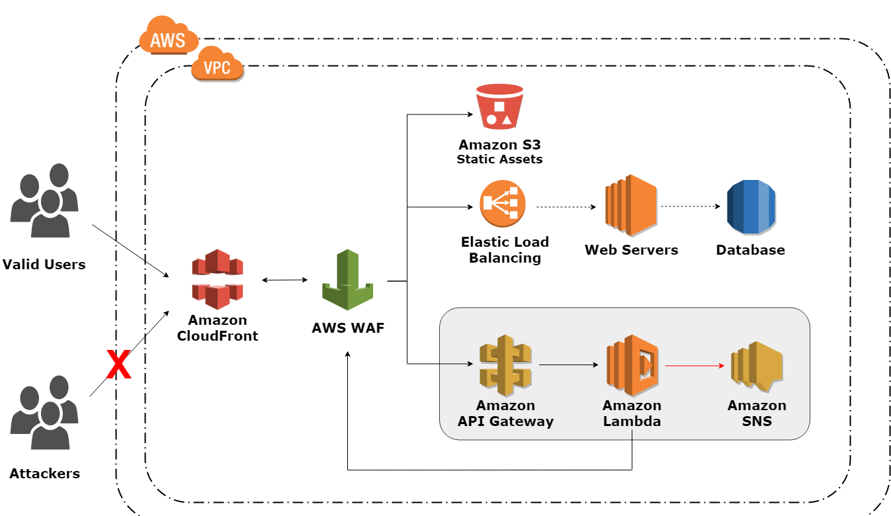

# Cloud computing on AWS

## Team Information

| Name | NEU ID | Email Address |
| --- | --- | --- |
| Aditi Jalkote| 001404314 | jalkote.a@husky.neu.edu |
| Akash Katakam| 001400025 | katakam.a@husky.neu.edu |
| Tanmayee Kalluri| 001400957 | kalluri.t@husky.neu.edu |

## Technology Stack

Java, Spring Boot, MySQL, Maven

## Build Instructions

1. Create a Spring Boot application
2. Update application.properties file with database connection details
3. Run the application as "Spring Boot App"

## Deploy Instructions

1. Open Postman application to test API results
2. Now select the POST option and enter the URL as <http://localhost:8080/user/register>
3. In the body section below, select 'raw' and then select 'JSON(application/json)'
4. Write the parameters to be sent in JSON format and click on 'Send', see the results on the window below
5. Now select GET option and enter the URL as <http://localhost:8080/>
6. In the 'authorization' section, select 'Basic Auth'
7. Enter the credentials and click 'Send'

## Running Tests

Go to the source folder and run `mvn test` command in the terminal

## CI/CD
